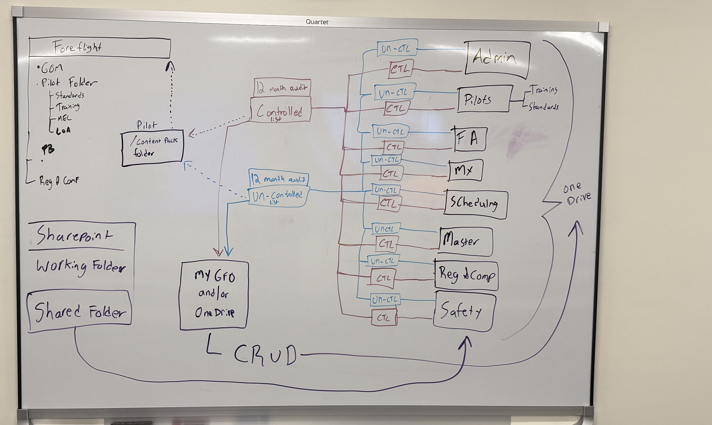

# Group Drives + Document Control — SharePoint / OneDrive under the controlled-list process — Design Spec

- **Date:** 2026-07-30
- **Status:** **Draft for review — NOT approved for implementation.** Written from the 2026-07-30 whiteboard photo + Bryan's steer. §11 lists what has to be answered before a plan is cut.
- **Author:** Bryan Dunlop (whiteboard) + Claude
- **Branch:** `claude/sharepoint-onedrive-drive-management-e9d5n2`
- **Surface:** extends the existing Document Compliance module (`src/components/documents/`)
- **Nature of deliverable:** architecture for a prototype / reference implementation on the mock store, in the existing patterns. Not production Graph plumbing — but the seams are named so the real integration drops in without a rewrite.

---

## 1. What the whiteboard says

Transcribed so the decision survives the photo. Four zones:

**Right — eight group drives, each split two ways.** `Admin` · `Pilots` (sub-folders `Training`, `Standards`) · `FA` · `Mx` · `Scheduling` · `Master` · `Reg & Comp` · `Safety`. Every group has a **CTL** bucket and an **Un-CTL** bucket. A brace spanning the whole column labels it **OneDrive**.

**Middle — two registers.** Every group's CTL bucket wires back (red) to one **Controlled list**; every Un-CTL bucket wires back (blue) to one **Un-Controlled list**. Each register carries a **12 month audit**. Both registers then flow two ways:
- down (solid) into **myGFO and/or OneDrive**, annotated **CRUD**;
- left (dotted) into the **Pilot / Content Pack folder**.

**Left-top — distribution.** The Pilot / Content Pack folder feeds (dotted) into **ForeFlight**, whose contents are listed as `GOM`, `Pilot Folder` (`Standards`, `Training`, `MEL`, `LoA`), `PB`, `Reg & Comp`.

**Left-bottom — authoring.** **SharePoint**: a **Working Folder** and a **Shared Folder**. A line runs from there along the bottom, labelled **CRUD**, and arrows up into the group-drive column.

**Bryan's steer on top of the drawing:** the drives on the right are a SharePoint or OneDrive drive per group; they can be managed **via myGFO or natively** — "but it would need to go through this process."

## 2. The requirement that drives the whole design

Two management surfaces, one process.

If myGFO were the only way in, "must go through this process" is a UI problem — put the classification step in the upload dialog and you are done. Bryan explicitly did not ask for that. A file can also be dropped into the group's drive **natively**, from Explorer, Teams, or the OneDrive client, by someone who has never opened myGFO.

So the process cannot be enforced at the point of entry. It has to be enforced by **reconciliation**: myGFO continuously compares what is actually in the drives against what is on the two registers, and anything it cannot account for is surfaced as work, not silently accepted. That single fact decides the shape of everything below.

The corollary is the thing to be honest about up front: **there is a window** between a native drop and the next reconcile in which a file exists in a group drive and is on no register. The design does not pretend to close that window; it makes it short, visible, and impossible to mistake for a classified state (§6).

## 3. Model: the register is the control plane, the drive is the storage plane

**A document's classification is a property of its register entry, never of the folder it sits in.**

This is the load-bearing decision. The tempting read of the whiteboard is that `…/Pilots/CTL/` *is* the controlled state — the folder makes it so. That inverts the control: dragging a file between two folders in SharePoint would then reclassify a controlled document, with no approval, no audit entry, and no way to tell afterwards that it happened. That is precisely the failure the controlled list exists to prevent.

So:

| Plane | Lives in | Holds | System of record for |
|---|---|---|---|
| **Control** | myGFO | register entries: classification, owner group, revision + approval state, audit dates, distribution targets | *whether* a document is controlled, what revision is effective, who signed for it |
| **Storage** | SharePoint / OneDrive | the bytes, version history, native co-authoring | the file content |

The CTL / Un-CTL folders on the whiteboard stay — they are how the drive *renders* the register to someone browsing natively, and they are what makes native browsing safe to look at. But they are an **output** of classification, not the input. myGFO files the item into the right bucket; a human moving it between buckets in SharePoint is a discrepancy to reconcile (§6), not a reclassification.

**The register entry binds to the drive item by immutable id — `driveId` + `itemId` — never by path.** Paths change when someone renames a folder; the binding must not.

## 4. Recommendation: back the group drives with SharePoint document libraries, not personal OneDrive

The brace on the whiteboard says "OneDrive," and Bryan's steer says "SharePoint or OneDrive." For the *user experience* those are the same thing — the OneDrive client syncs a SharePoint library to Explorer, and that is almost certainly what the brace means. For the *backing store* they are materially different, and the choice should be made deliberately:

1. **Ownership survives turnover.** A personal OneDrive is a user object. When that person leaves, the drive enters a retention window and is deleted. A group's controlled documents cannot live somewhere that dies with an employee. A SharePoint library belongs to the site/group.
2. **Least privilege actually exists.** For SharePoint, Graph offers **`Sites.Selected`** — an application permission that grants nothing until an administrator grants this app access to *specific* sites. For personal OneDrive there is no equivalent; app-only access to arbitrary users' drives means **`Files.Read.All` / `Files.ReadWrite.All`**, which is tenant-wide access to every file every employee owns. Handing myGFO that scope to manage eight group folders is not a trade worth making.
3. **Permissions are the enforcement surface.** §5 depends on being able to make the CTL bucket read-only to humans and writable only by the sync identity. Library-level permissions do that cleanly.

**Recommendation:** each of the eight groups is a SharePoint document library (one site with eight libraries, or one library with eight top-level folders — see [[Q3]]), surfaced to users through OneDrive sync so it still *looks* like the whiteboard. myGFO holds `driveId` per group and never needs a tenant-wide file scope.

## 5. Where each folder on the whiteboard fits

**SharePoint Working Folder** — drafting. Nothing here is on either register; it is pre-process by definition. This is where a native author works before the document enters control. The `CRUD` arrow from here into the group drives is *promotion*: the act of moving a file out of Working and into a group drive is the act of asking for it to be classified.

**SharePoint Shared Folder** — the cross-group surface: things more than one group reads but no one group governs. Its `CRUD` arrow also lands in the group column.

**Group `Un-CTL` bucket** — registered, audited, not revision-controlled. Read-write to the group. Its register entry gives it an owner, a review date, and a place on the uncontrolled list.

**Group `CTL` bucket** — registered and revision-controlled. **Read-only to humans; writable only by myGFO's sync identity.** This is the second half of the enforcement story and it matters: if a pilot can open the controlled GOM in SharePoint and type into it, the four-eyes draft→approve→publish pipeline the documents module already implements is bypassed by a double-click. Editing a controlled document means starting a revision — in myGFO, or by working a copy in the Working Folder and submitting it. Either way it lands back through approval.

*This reading of Working vs Shared is inferred from the layout, not labelled on the board — see [[Q1]].*

**`Master`** — read as the corporate/all-hands group, peer to the other seven, not a superset of them ([[Q2]]).

**`Pilots → Training` / `Standards`** — sub-folders within the Pilots group, not separate groups. Both role ids already exist in `ADDITIONAL_ROLES` (`training`, `standards`), as does `reg-comp`.

## 6. Reconciliation — how "it would need to go through this process" is enforced

Every drive item in scope is in exactly one of four states, and the state is computed, never stored on the file:

| State | Meaning | Where it shows |
|---|---|---|
| `registered` | drive item ↔ register entry, content hash matches | normal |
| `unclassified` | in a group drive, on no register — a native drop | **Intake queue** |
| `drifted` | registered, but the bytes changed outside myGFO | **Intake queue**, flagged by class |
| `orphaned` | register entry whose drive item is gone or moved out of scope | **Intake queue** |

**The intake queue is the process.** It is a work list owned by each group's document owner: classify this (CTL / Un-CTL / not a document — reject back to Working), or account for this change. Nothing auto-classifies. An `unclassified` item is not "uncontrolled by default" — that would quietly make the safest-sounding word mean "nobody has looked at it," which is how an uncontrolled register fills with documents nobody chose to put there.

**`drifted` is asymmetric by class, and this is the point of the whole design:**
- an Un-CTL item drifting is expected — record the new hash, bump `lastModified`, done;
- a **CTL item drifting is an incident**. It means the read-only permission in §5 failed or was bypassed. It raises a flag on the register entry, notifies the owner and the document manager, and the effective revision in myGFO **does not change** — a native edit can never become the effective revision of a controlled document. The register keeps pointing at the last approved revision; the drift is a discrepancy to be resolved (restore, or take it through a revision).

**Mechanics.** Graph change notifications (a subscription per drive) tell myGFO *that* something changed; they do not say what. So the notification triggers a **delta query** (`/drives/{id}/root/delta`) which returns the changed items and a token for next time. Delta is also the cold-start and the safety net: a scheduled delta sweep runs regardless of notifications, because driveItem subscriptions expire (~30 days) and need renewal, and a missed notification must not mean a permanently invisible file. **Delta is the source of truth; notifications only make it prompt.**

## 7. Controlled vs uncontrolled — what the split has to buy

The distinction only earns its keep if the two lists behave differently. They do, and most of it is already built:

|  | Controlled (CTL) | Uncontrolled (Un-CTL) |
|---|---|---|
| Change path | draft → approve → publish, approver ≠ author | direct edit |
| Effective revision | pinned; supersedes on publish | latest is latest |
| Acknowledgment | can require initials / signature | none |
| Native editing | blocked (§5) | allowed |
| Drift | incident | expected |
| Point-in-time answer | must be reconstructable | not required |

The documents module already implements the left column — `DocumentClassConfig.controlled` gates four-eyes, `DocRevision.status` carries `draft → pending-approval → approved → published → superseded`, the reducer enforces `decidedByUserId !== authorUserId`, and `DocAcknowledgment` is scoped to `(doc, revision, user)` so publishing re-arms it. **What is new here is not the control model. It is the group/drive axis and the two registers as first-class, browsable objects.**

**Point-in-time durability.** "What was the effective revision on date X" must not depend on SharePoint version history — a tenant admin can prune it, and retention policy is not our policy. On publish of a controlled revision, snapshot the rendered file to the WORM blob container the project already specifies (`Storage__SignedDocsContainerUri`). The register entry cites the blob; SharePoint holds the working copy.

## 8. The 12-month audit

Both registers carry it — this is a periodic re-attestation of the *register*, distinct from the per-document review cycle that already exists (`Doc.reviewCycleDays`, `nextReviewDate`, `DocReviewRecord`).

- **Per-document review** (built): "is this document still correct?" — cadence per class, 365 days on `sop`/`manual`.
- **Register audit** (new): "is this list still the truth?" — for each group, for each register: every entry accounted for, no unclassified backlog, every drive item on a list, classifications still right, owners still employed. Produces one dated, attributable audit record per (group, register) — the artifact you hand an auditor.

An audit cannot be closed with a non-empty intake queue for that group. That is what makes §6 a process rather than a dashboard.

## 9. Distribution — the ForeFlight content pack

Both registers feed the Pilot / Content Pack folder (dotted), which feeds ForeFlight. Note what the ForeFlight box actually lists: `GOM`, `Pilot Folder` (`Standards`, `Training`, `MEL`, `LoA`), `PB`, `Reg & Comp`. That is **a pilot-facing subset, not a mirror of the registers** — no Mx, no Scheduling, no FA. So:

**The content pack is a projection: register entries × `distributeToForeFlight` × pilot audience.** It is a per-entry opt-in, not a folder-location rule, so a Safety document meant for crew can be included without moving it out of the Safety group. The pack's folder tree is authored (it maps to the ForeFlight box's structure), not derived from the group tree — pilots see `Pilot Folder/Standards`, not `Pilots/CTL`.

Uncontrolled documents *are* eligible (the whiteboard draws both dotted arrows). A controlled document publishes into the pack on revision publish; an uncontrolled one on change. Every pack build is stamped with the register revision it was built from, so "which revision is on the iPad" is answerable without asking the iPad.

`src/utils/foreflight/client.ts` has an `uploadFile` seam; whether the real content-pack path is that API or a synced folder is [[Q5]].

## 10. What exists, what's new

**Reuse as-is:** `DocRevision` + status machine, four-eyes reducer enforcement, `DocAcknowledgment`, `DocReviewRecord`, `DocSuggestion` (crew→owner loop), `mockChecksum`, the Document Center reader (`docReaderPath`), `DOC_CLASSES` as config.

**New:**
1. `DocGroup` — the eight groups as config, in `classes.ts` style: id, label, owner roles, sub-folders, `driveId`. Config, not code.
2. `DocDriveBinding` on the document identity — `{ groupId, driveId, itemId, classification: 'controlled' | 'uncontrolled', contentHash, lastSyncedAtUtc }`. Classification moves here **as a per-document property**. Today `controlled` is per-class, which cannot express "this Safety PDF is controlled, that one isn't" within one class. Class stays the default; the binding is the authority.
3. `DriveSyncEngine` (pure) — `reconcile(driveItems, registerEntries) → { unclassified, drifted, orphaned, registered }`. Pure and unit-tested; the Graph client is a thin caller, mockable, exactly as `SchedulingService` wraps the pure scheduling engine.
4. `RegisterAudit` — the (group, register, period) attestation record.
5. **Surfaces:** a Registers page (two lists, filterable by group, the auditor's view); a per-group Intake queue; an audit panel. Reader stays the Document Center — D66 already ruled it the only reader.

**Config keys** (naming per the CLAUDE.md contract; nothing wired until approved): `Graph__TenantId`, `Graph__ClientId`, `Graph__GroupDriveMap`, `Graph__DeltaSweepMinutes`, `Graph__SubscriptionRenewalHours`, `Documents__RegisterAuditMonths` = `12`. **No Graph secret is introduced** — app-only auth via the API's managed identity with `Sites.Selected`, granted per site. If [[Q3]] lands on personal OneDrive, that changes and the scope discussion in §4.2 has to be reopened explicitly.

**Guardrails that apply** (from CLAUDE.md): file names and item ids are loggable, file *contents* are not; a published controlled revision is append-only and corrected by superseding revision, never by editing the drive item; drive items are not airworthiness records and nothing here touches the tech-log ledger.

## 11. Open questions — answer before a plan is cut

1. **[[Q1]] Working vs Shared Folder.** Is my §5 reading right — Working = pre-process drafting (on no register), Shared = cross-group published surface? Or is Shared also a staging area?
2. **[[Q2]] `Master`.** A ninth peer group (corporate/all-hands), or the union/index of the other eight?
3. **[[Q3]] Drive topology.** One SharePoint site with eight libraries, one library with eight folders, or eight sites? Drives the `Sites.Selected` grant and the sync-scope story. Also: confirm SharePoint-backed rather than personal OneDrive (§4).
4. **[[Q4]] Who classifies?** Per-group document owner, the central document manager, or either? And who may *reclassify* Un-CTL → CTL — that promotion is the moment a document acquires regulatory weight.
5. **[[Q5]] ForeFlight path.** Content-pack API upload, or a synced folder ForeFlight ingests? Decides whether §9 is a push with a receipt or a file drop.
6. **[[Q6]] Scope of Phase 1 here.** Full reconcile against a mocked Graph, or registers + intake UI over the existing mock store with the drive layer stubbed? My recommendation: the latter first — the pure `DriveSyncEngine` and both registers are the valuable, testable half, and they are what makes the Graph work mechanical when it comes.
7. **[[Q7]] Retention.** Does the 12-month register audit have a retention requirement of its own (Part 91 record-keeping), or is it an internal quality artifact?

## 12. Suggested slicing (once §11 is answered)

- **Slice 1 — registers over the mock store.** `DocGroup` config, `DocDriveBinding`, both register views, per-document classification. No Graph.
- **Slice 2 — reconcile + intake.** Pure `DriveSyncEngine` + tests (unclassified / drifted / orphaned / CTL-drift-is-an-incident), intake queue UI, mock drive fixtures.
- **Slice 3 — the 12-month audit.** `RegisterAudit`, the "cannot close with a non-empty queue" rule, the audit artifact.
- **Slice 4 — content pack projection.** `distributeToForeFlight`, authored pack tree, build stamped with register revision.
- **Slice 5 — real Graph.** Delta + subscriptions + renewal behind the seam Slice 2 defined. Separate call, separate review.
